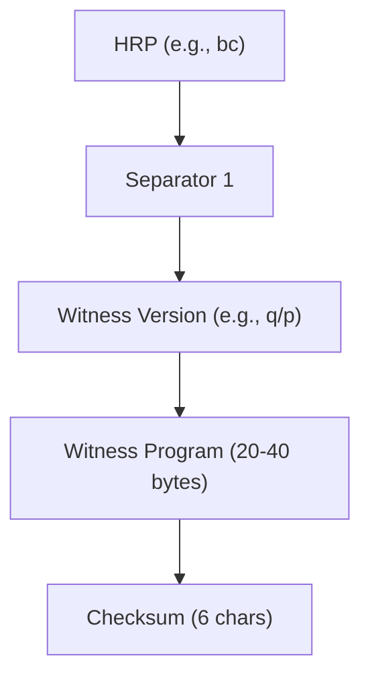
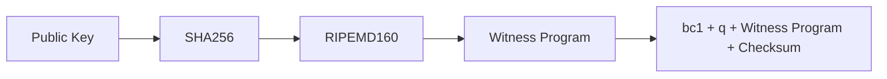

# Bech32m Encoding

An address is an encoded output script.

---

## Structure of a Bech32m Address

### Components:
1. **Human-Readable Part (HRP)**:
   - Prefix agreed by the network (e.g., `bc` for Bitcoin mainnet, `tb` for testnet).
2. **Separator**: `1`
3. **Data Part**:
   - Witness Version
   - Witness Program
   - Checksum

## Data Part Details

### 1. Witness Version
- Encoded as **1 character** (`q` = SegWit v0, `p` = SegWit v1).
- Values: 0–16 (17 possible versions).

### 2. Witness Program
- **Length**: 2–40 bytes.
  - **SegWit v0**: 20 or 32 bytes (P2WPKH/P2WSH).
  - **SegWit v1 (Taproot)**: 32 bytes.

### 3. Checksum
- 6 characters generated using a BCH code (error detection only).

---

## Address Construction

### P2WPKH (SegWit v0)
1. **HRP**: `bc` (mainnet) or `tb` (testnet).
2. **Witness Version**: `q` (version 0).
3. **Witness Program**: `RIPEMD160(SHA256(public_key))` (20 bytes).
4. **Checksum**: BCH-generated.

## Pay to Witness Script Hash (P2WSH) Output

For the **pay to witness script hash (P2WSH)** output, we don’t use the P2SH algorithm. Instead, we take the script, pass it into a **SHA256** hash function, and use the **32-byte digest** of that function in the witness program.  

For **P2SH**, the SHA256 digest was hashed again with **RIPEMD-160**, but that may not be secure in some cases; for details, see [P2SH Collision Attacks](#).  

A result of using SHA256 without RIPEMD-160 is that **P2WSH commitments are 32 bytes (256 bits) instead of 20 bytes (160 bits)**.

---

## Pay to Taproot (P2TR) Output

For the **pay-to-taproot (P2TR)** output, the witness program is a **point on the secp256k1 curve**.  

It may be a simple public key, but in most cases, it should be a **public key that commits to some additional data**.
