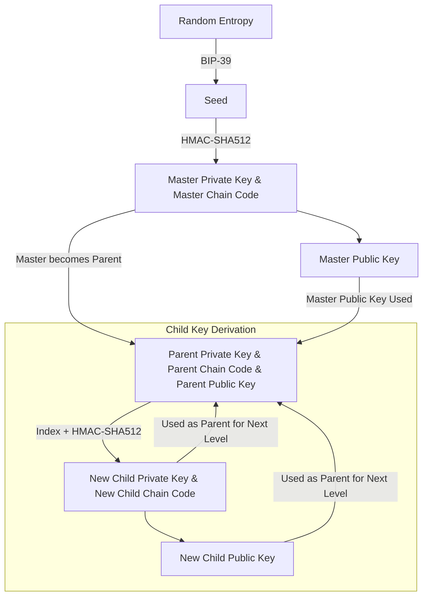
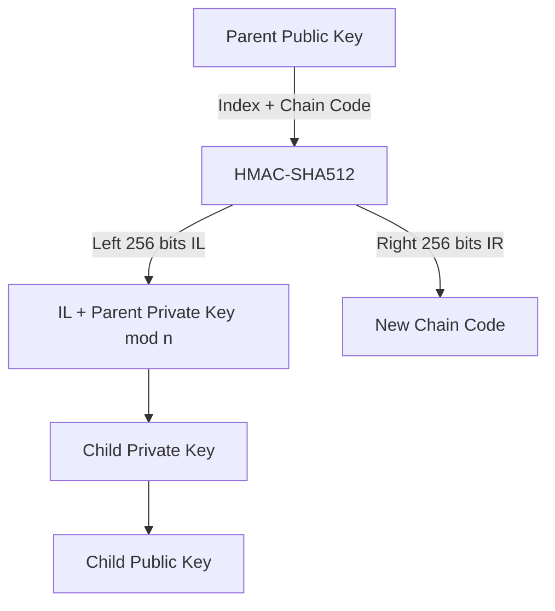

# Deterministic Key Generation and HD Wallets

## Hash Functions and Deterministic Key Generation
- A **hash function** always produces the same output for the same input, but even a slight change in input results in a completely different output.
- A cryptographically secure hash function prevents prediction of the output even if the new input is known.
- A **seed** (random value) can be used to deterministically generate a sequence of derived values.

### Example of Deterministic Key Generation:
```bash
# Generate entropy (random value)
$ dd if=/dev/random count=1 status=none | sha256sum
f1cc3bc03ef51cb43ee7844460fa5049e779e7425a6349c8e89dfbb0fd97bb73  -

# Set the seed
$ seed=f1cc3bc03ef51cb43ee7844460fa5049e779e7425a6349c8e89dfbb0fd97bb73

# Generate deterministic values
$ for i in {0..2} ; do echo "$seed + $i" | sha256sum ; done
```


## Deterministic Wallets
If these derived values are used as private keys, they can always be regenerated using the seed.  
A deterministic wallet can be backed up by storing just the **seed** and the **key generation algorithm**.

## Public Child Key Derivation
Elliptic Curve Cryptography (ECC) allows deriving a public key (**K**) from a private key (**k**) using a generator point (**G**):

\[
K = k \times G
\]

A child key pair can be created by adding the same value to both sides:

\[
K + (123 \times G) = (k + 123) \times G
\]

Key tweaks allow generating child public keys **without knowledge of the private key**.  
Bob can generates multiple public keys from one public key by adding a constant c to the public key. If I know the constant c he added, I'll be able to derive the corresponding private key.

This is useful for **separating frontend wallet applications from signing devices** (e.g., hardware wallets).

## Hierarchical Deterministic (HD) Wallets (BIP32)
HD wallets use a **tree structure** instead of a linear sequence of keys.  
Each key can be a **parent** of multiple child keys, enabling:
- **Separation of receiving and change addresses**.
- **Organizational structure** (e.g., departments, subsidiaries).

There is no limit on the depth of the key tree.

## Seeds and Recovery Codes
HD wallets derive **all private keys** from a **single seed**.  
Losing access to the seed means losing access to all associated private keys.  

**Recovery codes** use **human-readable words** for easy backup (e.g., **BIP-39 mnemonics**).

### Example of a Seed Encoded in Hex and Words:
- **Hex-encoded**:  
  `0C1E 24E5 9177 79D2 97E1 4D45 F14E 1A1A`
- **Word-encoded**:  
  `army van defense carry jealous true garbage claim echo media make crunch`

  We create a bunch of random bytes, use an algorthim to turn them into human readable words and use another algorithm to turn that into a seed which using a seed algorithm can be used to create a bunch of keys.

### Risks of Memorizing Recovery Codes:
- **Memory loss** results in permanent loss of funds.
- **Physical coercion** can force disclosure of the code.
- Writing down the **recovery code** is **highly recommended**.

## Conclusion
- **Deterministic key generation** ensures that private keys can always be recreated from a seed.
- **Public key derivation** allows wallets to distribute public keys securely.
- **HD wallets (BIP32)** enhance security and scalability by structuring keys hierarchically.
- **Recovery codes** simplify backups but must be stored securely to prevent loss or theft.
# BIP-32: Hierarchical Deterministic Wallets

## Overview
BIP-32 (Bitcoin Improvement Proposal 32) defines **Hierarchical Deterministic (HD) wallets**, allowing the generation of an entire tree of keys from a single master seed.

### **Key Benefits of BIP-32**
- A single seed can derive many keys.
- Public keys can be derived without exposing private keys.
- Supports hierarchical organization of keys.
- Enables watch-only wallets.

## **BIP-32 Key Derivation Process**



## **Master Key Generation**
1. **Start with a BIP-39 Seed.**
2. Compute HMAC-SHA512 with the key `"Bitcoin seed"` and the seed as input.
3. The output is **512 bits**:
   - **Left 256 bits** → **Master Private Key**
   - **Right 256 bits** → **Master Chain Code**
4. The **Master Public Key** is derived using the secp256k1 curve.

## **Child Key Derivation**
BIP-32 allows two types of child key derivation:
1. **Normal (Non-Hardened) Child Keys** (Index `0` to `2³¹ - 1`)
2. **Hardened Child Keys** (Index `2³¹` to `2³² - 1`)

### **Normal Child Key Derivation**

- Uses **parent public key**, **index**, and **parent chain code**.
- **Formula:**
  ```
  HMAC-SHA512(parent chain code, parent public key || index)
  ```
- Left 256 bits (**IL**) modifies the private key:
  ```
  child_private_key = (IL + parent_private_key) mod n
  ```
- Right 256 bits (**IR**) becomes the **new child chain code**.
- **Allows public key derivation without needing the private key.**

### **Hardened Child Key Derivation**

- Uses **parent private key**, **index**, and **parent chain code**.
- **Formula:**
  ```
  HMAC-SHA512(parent chain code, parent private key || index)
  ```
- The left 256 bits (**IL**) tweak the private key:
  ```
  child_private_key = (IL + parent_private_key) mod n
  ```
- **This prevents public key-based attacks that could leak the parent private key.**

## **Summary**
| Feature           | Normal Derivation | Hardened Derivation |
|------------------|-----------------|------------------|
| Uses Public Key  | ✅ Yes           | ❌ No (Uses Private Key) |
| Private Key Needed? | ❌ No            | ✅ Yes |
| Risk of Parent Key Leak | ⚠️ Possible  | ✅ Secure |
| Index Range      | `0` to `2³¹ - 1` | `2³¹` to `2³² - 1` |

## **Conclusion**
- **Use normal derivation** when you need a public key hierarchy.
- **Use hardened derivation** when you want to protect the parent key from exposure.

BIP-32 enables structured key management while maintaining security. 🚀
