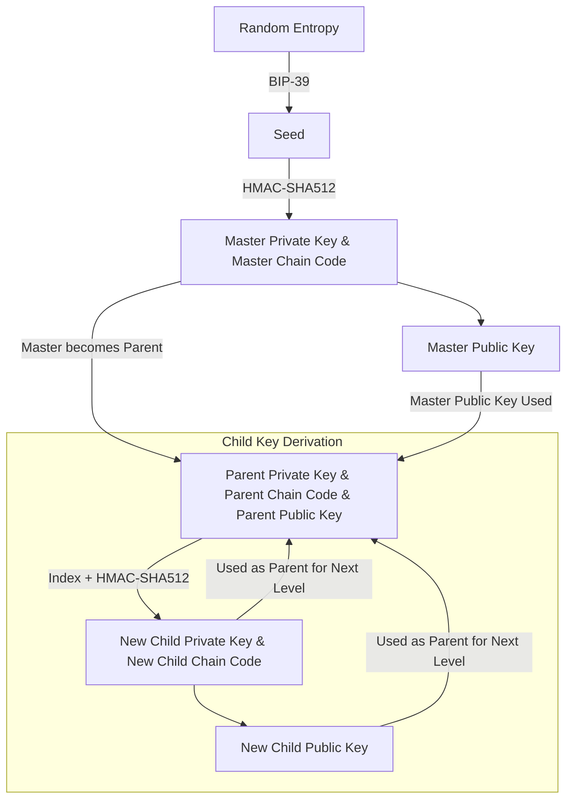

# Summary of Deterministic Key Generation and HD Wallets

## Hash Functions and Deterministic Key Generation
- A **hash function** always produces the same output for the same input, but even a slight change in input results in a completely different output.
- A cryptographically secure hash function prevents prediction of the output even if the new input is known.
- A **seed** (random value) can be used to deterministically generate a sequence of derived values.

### Example of Deterministic Key Generation:
```bash
# Generate entropy (random value)
$ dd if=/dev/random count=1 status=none | sha256sum
f1cc3bc03ef51cb43ee7844460fa5049e779e7425a6349c8e89dfbb0fd97bb73  -

# Set the seed
$ seed=f1cc3bc03ef51cb43ee7844460fa5049e779e7425a6349c8e89dfbb0fd97bb73

# Generate deterministic values
$ for i in {0..2} ; do echo "$seed + $i" | sha256sum ; done
# Deterministic Key Generation and HD Wallets

## Deterministic Wallets
If these derived values are used as private keys, they can always be regenerated using the seed.  
A deterministic wallet can be backed up by storing just the **seed** and the **key generation algorithm**.

## Public Child Key Derivation
Elliptic Curve Cryptography (ECC) allows deriving a public key (**K**) from a private key (**k**) using a generator point (**G**):

\[
K = k \times G
\]

A child key pair can be created by adding the same value to both sides:

\[
K + (123 \times G) = (k + 123) \times G
\]

Key tweaks allow generating child public keys **without knowledge of the private key**.  
Bob can generates multiple public keys from one public key by adding a constant c to the public key. If I know the constant c he added, I'll be able to derive the corresponding private key.

This is useful for **separating frontend wallet applications from signing devices** (e.g., hardware wallets).

## Hierarchical Deterministic (HD) Wallets (BIP32)
HD wallets use a **tree structure** instead of a linear sequence of keys.  
Each key can be a **parent** of multiple child keys, enabling:
- **Separation of receiving and change addresses**.
- **Organizational structure** (e.g., departments, subsidiaries).

There is no limit on the depth of the key tree.

## Seeds and Recovery Codes
HD wallets derive **all private keys** from a **single seed**.  
Losing access to the seed means losing access to all associated private keys.  

**Recovery codes** use **human-readable words** for easy backup (e.g., **BIP-39 mnemonics**).

### Example of a Seed Encoded in Hex and Words:
- **Hex-encoded**:  
  `0C1E 24E5 9177 79D2 97E1 4D45 F14E 1A1A`
- **Word-encoded**:  
  `army van defense carry jealous true garbage claim echo media make crunch`

  We create a bunch of random bytes, use an algorthim to turn them into human readable words and use another algorithm to turn that into a seed which using a seed algorithm can be used to create a bunch of keys.

### Risks of Memorizing Recovery Codes:
- **Memory loss** results in permanent loss of funds.
- **Physical coercion** can force disclosure of the code.
- Writing down the **recovery code** is **highly recommended**.

## Conclusion
- **Deterministic key generation** ensures that private keys can always be recreated from a seed.
- **Public key derivation** allows wallets to distribute public keys securely.
- **HD wallets (BIP32)** enhance security and scalability by structuring keys hierarchically.
- **Recovery codes** simplify backups but must be stored securely to prevent loss or theft.

#### Bip32
In BIP32, we start with a BIP39 seed and pass it through an HMAC-SHA512 function, which produces a 512-bit hash. The left 256 bits are used as the master private key, while the right 256 bits are used as the master chain code. The master public key is generated from the master private key using ECDSA.

To derive child keys, we pass a combination of the parent keys (keys generated above) along with an index into the HMAC-SHA512 function to generate a new set of child keys. The diagram below explains the concept more clearly.

